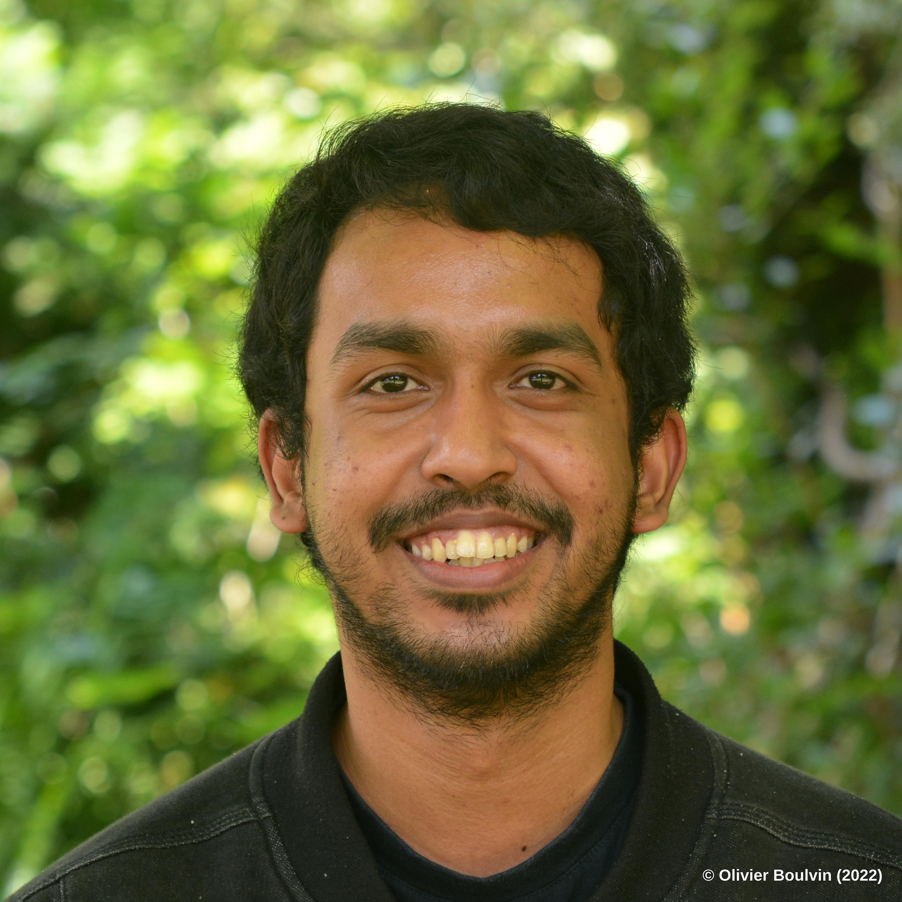

  

  

    

      I am a GNSS researcher at the Royal Observatory of Belgium.
    

    

      My research interests include GNSS for Climate, GNSS data quality,
      GNSS interference detection, and AI for GNSS data curation.
    

    

      I enjoy working with Space Geodetic Techniques data in general,
      developing data-processing-workflow tools, and exploring new ways
      to understand the quality and reliability of geodetic observations.
    

  

## Research Interests
- Geodesy
- GNSS
- GNSS for Climate
- GNSS Interference
- GNSS Data Quality
- Data Science

## About Me
Outside research, I enjoy traveling with my wife, photography, and baku terek.

I am also a big fan of automation. If something takes 30 minutes to do manually, I will happily spend an entire day writing a script to do it automatically. Because apparently, that is the more efficient way to spend my time. 😄

[LinkedIn](https://www.linkedin.com/in/fikribamahry)
[ORCID](https://orcid.org/0000-0002-6518-2912)
